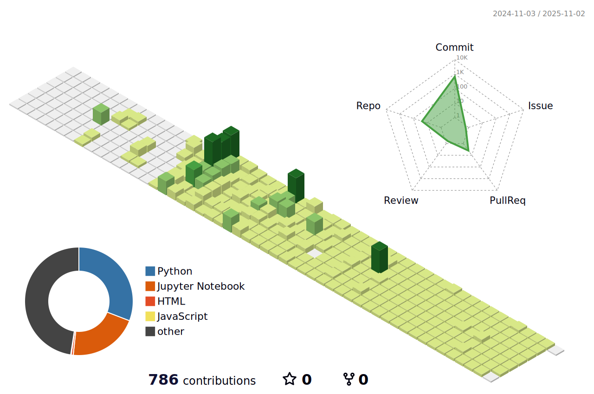

<!-- # 안녕하세요! 홍원의 프로필입니다👋!-->

<!--
# 교육 이력 

!-->
## 👀 About Me

  #### :🎓 Major in Electrical Engineering at Myongji University (2019 ~ 2024)
  #### :🌐 MS AI Schoool (2024 ~ )
   
  
---

## ⚡Latest Project
### 공공임대주택 정보 안내 도우미 – **찾아줘 홈즈🐶**

> 공공임대주택 신청 공고문을 기반으로  
> 사용자의 조건에 맞는 정보를 자동으로 추천하고 질의응답까지 수행하는 AI 기반 정보 안내 시스템

- 🧑‍💻 **Role** : LLM 기반 RAG 설계 및 카카오톡 챗봇 연동
- 📅 **기간** : 2025.04.02 ~ 2025.04.18
- 🎥 [홍보 영상 보기](https://github.com/hongwon1031/MS_AI_project_2/blob/main/%EC%8B%9C%EC%97%B0%EC%98%81%EC%83%81.mp4)
- 📄 [최종 발표 자료 PDF](https://github.com/hongwon1031/MS_AI_project_2/blob/main/%5B%EB%B3%B5%EB%8D%95%EB%B0%A97%5D%EB%B0%9C%ED%91%9C.pdf)

#### 🧰 tech stack
     
    

---

## 🚀 Project
  ### Myongji University
  - [쓰레기 자동 분류 시스템](https://github.com/hongwon1031/2024_DeepLearning_Project)
  - [PCB 기판 Warpage 예측](https://github.com/hongwon1031/Myungji_AI_Contest)
  - [인공지능 패션추천 및 가상피팅 시스템](https://github.com/hongwon1031/AI-based-Style-Recommendation-System)

  ### MS AI Schoool
  - [MS AI 6기 1번째 프로젝트](https://github.com/hongwon1031/MS_AI_Project_1)
  - [MS AI 6기 2번째 프로젝트](https://github.com/hongwon1031/MS_AI_project_2)

---
## 🔬 Study :
- [MLops](https://github.com/hongwon1031/MLops)
- [백준 문제풀이](https://github.com/hongwon1031/Baekjoon_Prac)
- [딥러닝 및 머신러닝 복습](https://github.com/hongwon1031/ML_prac)
- [Python 개념정리](https://github.com/hongwon1031/testRepo/tree/main/12)
- [데이터분석](https://github.com/hongwon1031/DataFrame)
- [Html,CSS,JavaScript](https://github.com/hongwon1031/Html)

---
## 🧱 Tech Stack
  ### Language
  <!--Python-->
     
  <!--  -->

  ### Library
    

  ### ETC
   

<!---->

---
## 💻 Stats

  
  
<!---->

<!--
**hongwon1031/hongwon1031** is a ✨ _special_ ✨ repository because its `README.md` (this file) appears on your GitHub profile.

Here are some ideas to get you started:

- 🔭 I’m currently working on ...
- 🌱 I’m currently learning ...
- 👯 I’m looking to collaborate on ...
- 🤔 I’m looking for help with ...
- 💬 Ask me about ...
- 📫 How to reach me: ...
- 😄 Pronouns: ...
- ⚡ Fun fact: ...
!-->

